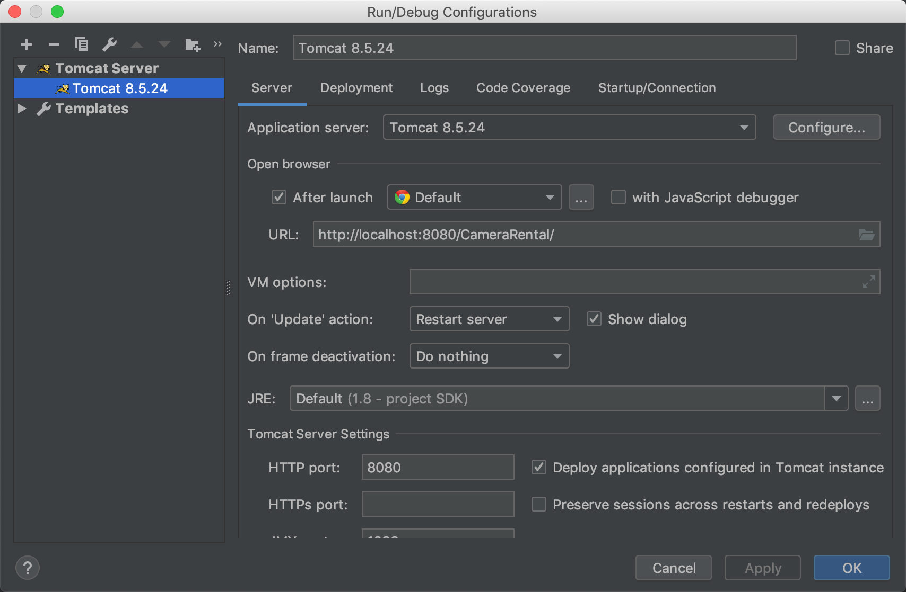

* `server.xml` 文件 `host` 节点添加下面这个
* `<Context docBase="/Users/apple/Desktop/test" path="/CameraRental/image/data" />`
* 一定要确保 `docBase` 路径存在否则无法启动
* 将 `Deploy applications configured in Tomcat instance` 勾上

* 注意将 `docBase` 修改为可以访问到的目录 `CameraRental` 修改为项目路径


1. 新建utf8数据库 rental

```sql
    CREATE DATABASE `rental` DEFAULT CHARACTER SET utf8 COLLATE utf8_general_ci;
```

2. 将 `rental.sql` 数据导入数据库
3. 运行项目
4. [输入链接 :http://localhost:8080/CameraRental/](http://localhost:8080/CameraRental)
5. 账号 `admin/123456`


